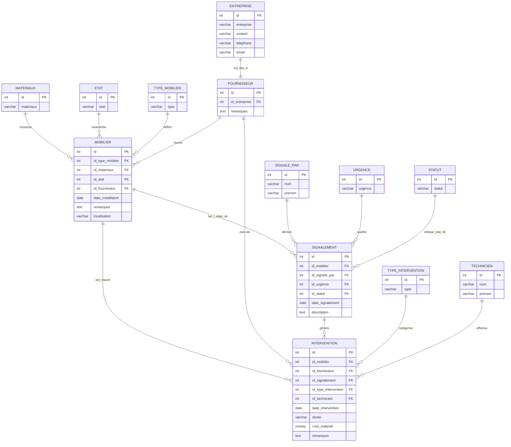

```mermaid

erDiagram
    MATERIAUX ||--o{ MOBILIER : "compose"
    ETAT ||--o{ MOBILIER : "caractérise"
    TYPE_MOBILIER ||--o{ MOBILIER : "définit"
    FOURNISSEUR ||--o{ MOBILIER : "fournit"
    ENTREPRISE ||--|| FOURNISSEUR : "est_liée_à"

    MOBILIER ||--o{ SIGNALEMENT : "fait_l_objet_de"
    SIGNALE_PAR ||--o{ SIGNALEMENT : "déclare"
    URGENCE ||--o{ SIGNALEMENT : "qualifie"
    STATUT ||--o{ SIGNALEMENT : "indique_etat_de"

    MOBILIER ||--o{ INTERVENTION : "est_réparé"
    FOURNISSEUR ||--o{ INTERVENTION : "exécute"
    SIGNALEMENT ||--o{ INTERVENTION : "génère"
    TYPE_INTERVENTION ||--o{ INTERVENTION : "catégorise"
    TECHNICIEN ||--o{ INTERVENTION : "effectue"

    MATERIAUX {
        int id PK
        varchar materiaux
    }
    ETAT {
        int id PK
        varchar etat
    }
    URGENCE {
        int id PK
        varchar urgence
    }
    STATUT {
        int id PK
        varchar statut
    }
    TYPE_INTERVENTION {
        int id PK
        varchar type
    }
    TECHNICIEN {
        int id PK
        varchar nom
        varchar prenom
    }
    SIGNALE_PAR {
        int id PK
        varchar nom
        varchar prenom
    }
    ENTREPRISE {
        int id PK
        varchar entreprise
        varchar contact
        varchar telephone
        varchar email
    }
    FOURNISSEUR {
        int id PK
        int id_entreprise FK
        text remarques
    }
    TYPE_MOBILIER {
        int id PK
        varchar type
    }
    MOBILIER {
        int id PK
        int id_type_mobilier FK
        int id_materiaux FK
        int id_etat FK
        int id_fournisseur FK
        date date_installation
        text remarques
        varchar localisation
    }
    SIGNALEMENT {
        int id PK
        int id_mobilier FK
        int id_signale_par FK
        int id_urgence FK
        int id_statut FK
        date date_signalement
        text description
    }
    INTERVENTION {
        int id PK
        int id_mobilier FK
        int id_fournisseur FK
        int id_signalement FK
        int id_type_intervention FK
        int id_technicien FK
        date date_intervention
        varchar duree
        money cout_materiel
        text remarques
    }
```
